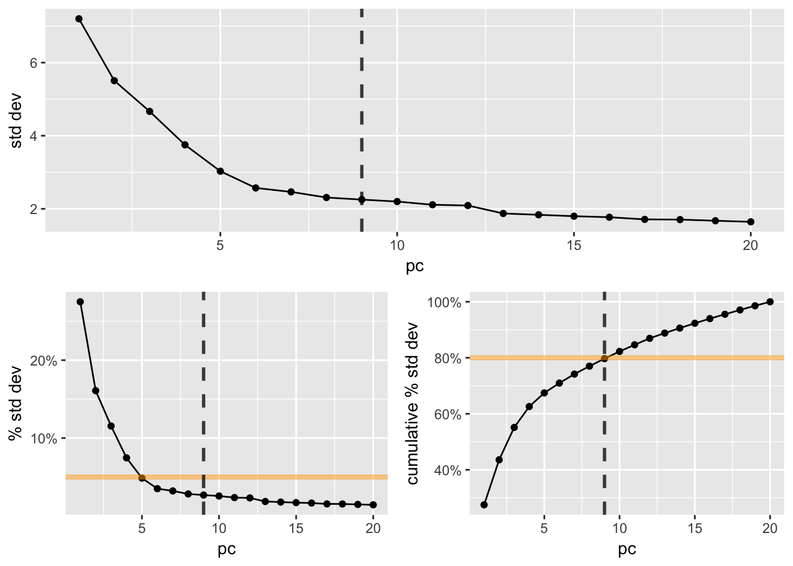
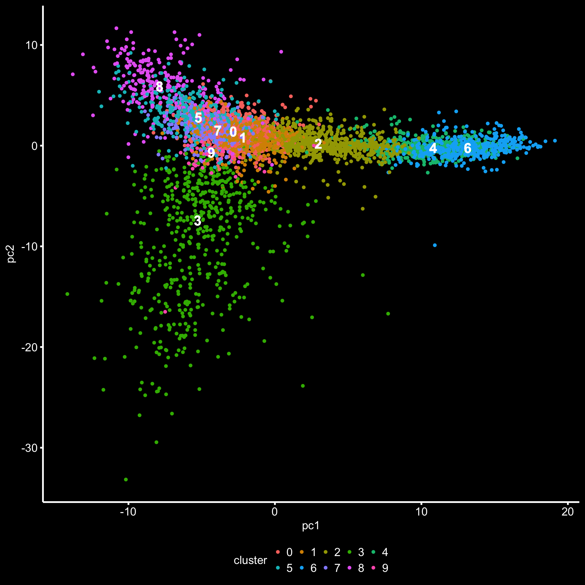

# bcbioSingleCell Clustering Report

*All **bcbioSingleCell functions** are available at: [http://bioinformatics.sph.harvard.edu/bcbioSingleCell/reference/index.html](http://bioinformatics.sph.harvard.edu/bcbioSingleCell/reference/index.html).*

#### Setting up

1. Install `bcbioSingleCell` and load the library:
	
	```r
	# devtools::install_github("hbc/bcbioSingleCell") # Add argument `ref = "develop"` if need development branch
	
	library(bcbioSingleCell)
	```
	
2. Create new RMarkdown file and choose the clustering template.

3. Edit the information in the files `_header.Rmd` and `_footer.Rmd` with experiment-specific information (I also include the experimental description with design).

3. We will perform clustering using the output from our QC analysis. To use the filtered data, fill in the `params` for `bcbFile` with the path to the filtered output data:

	```r
	title: "Seurat Clustering"
	author: "`r getOption('author')`"
	date: "`r Sys.Date()`"
	bibliography: bibliography.bib
	params:
	    bcbFile: "data/bcbFiltered.rda"
	    seuratName: "seurat"
	    pcCompute: 20
	    pcUse: FALSE
	    varsToRegress: !r c("nUMI", "mitoRatio", "S.Score", "G2M.Score")
	    resolution: 0.8
	    outputDir: "."
	---
	```

3. At he beginning of the Clustering analysis report, I added a summary of the clustering analysis workflow just below the `params` chunk:
	
	**Clustering analysis on all samples**
	
	For this clustering analysis, we will take the filtered cells output from the quality control analysis to identify cellular populations with similar transcriptional profiles. To identify these clusters the following steps need to be performed:

	1. Normalization and transformation of the raw gene counts per cell
	2. Identification of high variance genes
	3. Regression of unwanted variation (mitochondrial content, number of genes per cell, cell cycle, etc.)
	4. Identification of the primary sources of heterogeneity using PCA analysis and heatmaps
	5. Clustering cells based on significant PCs (metagenes)
	6. Evaluation of cell clusters
	
2. Run the setup chunk using the green arrow - this code will load your filtered data file specified in the `bcbFile` param (`bcbFiltered.rda`) and will save it to the variable `bcb`.

3. Generate the `seurat` object using the filtered data (`bcb`), then normalize and transform the raw gene counts per cell.

	Prior to any clustering analysis, the raw counts need to be normalized using global-scaling normalization. Global-scaling normalization (1) normalizes the gene expression measurements for each cell by the total expression, (2) multiplies this by a scale factor (10,000 by default), and (3) log-transforms the result. Following normalization, the average expression and dispersion for each gene is calculated, which places these genes into bins, and then a z-score for dispersion within each bin is calculated. This helps control for the relationship between variability and average expression. Finally, the genes are scaled and centered.

	```r
	seurat <- as(bcb, "seurat") %>%
	    NormalizeData(
		object = .,
		normalization.method = "LogNormalize",
		scale.factor = 10000) %>%
	    FindVariableGenes(
		object = .,
		mean.function = ExpMean,
		dispersion.function = LogVMR,
		do.plot = FALSE) %>%
	    ScaleData(
		object = .,
		model.use = "linear")
	```

4. Ensure that the data in the seurat object is properly filtered (do not need to include this inside the actual clustering report). These violin plots should match up with the histograms and bar plots in the quality control report.

	```r
	features <- c("nUMI", "nGene", "mitoRatio")
	sapply(seq_along(features), function(a) {
	    VlnPlot(
		seurat,
		features.plot = features[[a]],
		x.lab.rot = TRUE) %>%
		show
	}) %>%
	    invisible
	```

5. We can also explore the presence of cell markers of interest in all cells. 

	We can see in the violin plots below that we have a subset of cells expressing the markers of interest (ex. PAX7 and MYF5 genes). This was a useful step in this experiment, since if these markers weren't expressed, then the experiment did not work and there would be no need to continue.
	
	```{r qc_plots_markers, message=FALSE, warning=FALSE}
	VlnPlot(seurat,
	        features.plot = c("PAX7", "MYF5),
	        x.lab.rot = TRUE,
	        do.return = TRUE)
	```

	

6. Plot the high variance genes. Look at this plot similar to how you examine the dispersion plot in DESeq2 - look for decreasing dispersion with increasing mean expression. Generally this plot should be fine - shouldn't have a cloud of data/bullseye.

	```r
	VariableGenePlot(seurat)
	```
	
	
7. Regress out unwanted sources of variation

	The single-cell dataset contains "uninteresting" sources of variation in addition to interesting sources. This can include technical noise, batch effects, and/or uncontrolled biological variation (e.g. cell cycle). Regressing these signals out of the analysis can improve downstream dimensionality reduction and clustering [@Buettner2015-ur]. To mitigate the effect of these signals, [Seurat][] constructs linear models to predict gene expression based on user-defined variables. The scaled z-scored residuals of these models are used for dimensionality reduction and clustering.

	First, we assign each cell a score, based on its expression of G2/M and S phase markers. These marker sets should be anticorrelated in their expression levels, and cells expressing neither are likely not cycling and in G1 phase.

	In the following PCA plot, we are checking to see if the cells are grouping by cell cycle. If we don't see clear grouping of the cells into `G1`, `G2M`, and `S` clusters, then we don't need to regress out cell-cycle variation. 

	>***NOTE:** There are differences regarding which cells are in which phase of the cell cycle depending on whether the cells are analyzed as a single sample or analyzed with other samples. We still need to figure out why.*

	In the PCA plot below, we can see clear clusters by cell cycle on the PCA. Therefore, we will plan to regress out the cell cycle variation.

	```r
	ccm <- metadata(bcbFiltered)$organism %>%
	    str_match("^([A-Z])[a-z]+ ([a-z]+)$") %>%
	    .[, 2:3] %>%
	    as.character() %>%
	    paste0(collapse = "") %>%
	    tolower() %>%
	    cellCycleMarkers[[.]]
	sGenes <- ccm %>%
	    dplyr::filter(phase == "S") %>%
	    pull("symbol")
	g2mGenes <- ccm %>%
	    dplyr::filter(phase == "G2/M") %>%
	    pull("symbol")

	seurat <- CellCycleScoring(
	    seurat,
	    g2m.genes = g2mGenes,
	    s.genes = sGenes)
	# Cell-cycle `Phase` column should now be added to `seurat@meta.data`
	seuratPreregress <- seurat
	assignAndSaveData(
	    name = "seurat_preregress",
	    object = seuratPreregress,
	    dir = dataDir)

	RunPCA(
	    seuratPreregress,
	    pc.genes = c(sGenes, g2mGenes),
	    do.print = FALSE) %>%
	    plotPCA(interestingGroups = "phase", label = FALSE)
	```

	

8. Apply regression variables

	[Seurat][] regresses out variables of uninteresting variation individually against each gene, then rescales and centers the resulting residuals. We generally recommend minimizing the effects of variable read count depth (`nUMI`) and mitochondrial gene expression (`mitoRatio`). If the differences in mitochondrial gene expression represent a biological phenomenon that may help to distinguish cell clusters, then we advise not regressing it out. Cell-cycle regression is generally recommended but should be avoided for samples containing cells undergoing differentiation.

	In this report we will regress out the cell-cycle variation, so that we can examine clustering not due to cell cycle stage. However, we may not pick up different clusters of the Pax7+ cells at different stages of differentiation. We will explore the clustering without regressing out the cell cycle stages later.

	Now that regression has been applied, let's recheck to see if the cells are no longer clustering by cycle. We now see the phase clusters superimpose.

	```r
	seurat <- ScaleData(seurat, vars.to.regress = params$varsToRegress)

	RunPCA(
	    seurat,
	    pc.genes = c(sGenes, g2mGenes),
	    do.print = FALSE) %>%
	    plotPCA(interestingGroups = "phase", label = FALSE)
	```
	
	
9. Linear dimensionality reduction

	Next, we perform principal component analysis (PCA) on the scaled data and score each gene in the dataset (including genes not included in the PCA) based on their correlation with the calculated components.

	In particular, a heatmap of the PCs allows for easy exploration of the primary sources of heterogeneity in a dataset, and can be useful when trying to decide which PCs to include for further downstream analyses. Both cells and genes are ordered according to their PCA scores. Though clearly a supervised analysis, we find this to be a valuable tool for exploring correlated gene sets.

	```r
	seurat <- seurat %>%
	    RunPCA(do.print = FALSE) %>%
	    ProjectPCA(do.print = FALSE)
	```

	The heatmap shows the expression of the top 15 genes that most contribute to the PCs (positively and negatively). 

	```r
	PCHeatmap(
	    seurat,
	    col.use = CustomPalette(
		low = viridis(3)[[1]],
		mid = viridis(3)[[2]],
		high = viridis(3)[[3]]),
	    do.balanced = TRUE,
	    label.columns = FALSE,
	    pc.use = 1:params$pcCompute,
	    remove.key = TRUE)
	 ```

	

	The visualizations of the PCs show the scores for each of the top 15 +/- genes contributing to each PC.

	```r
	 VizPCA(
	    seurat,
	    pcs.use = 1:params$pcCompute,
	    do.balanced = TRUE,
	    nCol = 2)
	```
	
	

	The printed list include the top 15 genes contributing positively / negatively the most to each PC.

	```r
	 PrintPCA(
	    seurat,
	    pcs.print = 1:params$pcCompute)
	```


10. Determine statistically significant principal components

	To overcome the extensive technical noise in any single gene for scRNA-seq data, [Seurat][] clusters cells based on their PCA scores, with each PC essentially representing a "metagene" that combines information across a correlated gene set. Determining how many PCs to include downstream is therefore an important step. To accomplish this, we plot the standard deviation of each PC as an elbow plot.

	The plots below show where we have defined the principal component cutoff used downstream for dimensionality reduction. This is calculated automatically as the larger value of:

	1. The point where the principal components only contribute 5% of standard deviation (bottom left).
	2. The point where the principal components cumulatively contribute 80% of the standard deviation (bottom right).

	This methodology is also commonly used for PC covariate analysis on bulk RNA-seq samples.

	```r
	pcUse <- params$pcUse
	if (!is.numeric(params$pcUse)) {
	    pcUse <- pcCutoff(seurat) %>%
		seq(from = 1, to = .)
	}
	```

 	


Based on these plots, we will use 10 principal components for dimensionality reduction calculations.

11. Cluster the cells

	Seurat now includes an graph-based clustering approach. Importantly, the *distance metric* which drives the clustering analysis (based on previously identified PCs) remains the same. However, our approach to partioning the cellular distance matrix into clusters has dramatically improved. Our approach was heavily inspired by recent manuscripts which applied graph-based clustering approaches to scRNA-seq data [SNN-Cliq, Xu and Su, Bioinformatics, 2015] and CyTOF data [PhenoGraph, Levine et al., Cell, 2015]. Briefly, these methods embed cells in a graph structure - for example a K-nearest neighbor (KNN) graph, with edges drawn between cells with similar gene expression patterns, and then attempt to partition this graph into highly interconnected ‘quasi-cliques’ or ‘communities’. As in PhenoGraph, we first construct a KNN graph based on the euclidean distance in PCA space, and refine the edge weights between any two cells based on the shared overlap in their local neighborhoods (Jaccard distance). To cluster the cells, we apply modularity optimization techniques [SLM, Blondel et al., Journal of Statistical Mechanics], to iteratively group cells together, with the goal of optimizing the standard modularity function.

	```r
	seurat <- FindClusters(
	    seurat,
	    dims.use = pcUse,
	    force.recalc = TRUE,
	    print.output = TRUE,
	    resolution = params$resolution,
	    save.SNN = TRUE)

	# A summary of the parameters that were chosen for clustering are given below.

	PrintFindClustersParams(seurat)
	```

12. Run non-linear dimensional reduction (tSNE)

	[Seurat][] continues to use tSNE as a powerful tool to visualize and explore these datasets. While we no longer advise clustering directly on tSNE components, cells within the graph-based clusters determined above should co-localize on the tSNE plot. This is because the tSNE aims to place cells with similar local neighborhoods in high-dimensional space together in low-dimensional space. As input to the tSNE, we use the same PCs as input to the clustering analysis.

	```r
	seurat <- RunTSNE(
	    seurat,
	    dims.use = pcUse,
	    do.fast = TRUE)
	assignAndSaveData(
	    name = "seuratTSNE",
	    object = seurat,
	    dir = dataDir)

	PrintTSNEParams(seurat)

	lapply(seq_along(groupBy), function(a) {
	    if (groupBy[[a]] == "ident") {
		label <- TRUE
	    } else {
		label <- FALSE
	    }
	    plotTSNE(
		seurat,
		interestingGroups = groupBy[[a]],
		label = label) %>%
		show()
	    plotPCA(
		seurat,
		interestingGroups = groupBy[[a]],
		label = label) %>%
		show()
	}) %>%
	    invisible()
	```

 	
	
	

	Note that tSNE is not PCA! The measurement of distance in a tSNE plot is difficult to interpret, and is most helpful for the relationships of close neighbors. To better infer separation distance between the putative clusters, let's reapply PCA.

13. Cluster quality control

Let's look at the variance in the number of UMI counts (`nUMI`), gene detection (`nGene`), and the percentage of mitochondrial gene expression (`mitoRatio`), to see if there are any obvious cluster artefacts. We can also assess cell cycle batch effects (`S.Score`, `G2M.Score`) and any principal component bias toward individual clusters.

```r
plotFeatures(
    seurat,
    features = c("nUMI", "nGene",
                 "log10GenesPerUMI", "mitoRatio",
                 "S.Score", "G2M.Score"))
plotFeatures(
    seurat,
    features = paste0("PC", pcUse))
```

14. Conclusions

Overall, we see relatively nice clusters. However, we see little overlap between the cell clusters in the hPSC cells and the PAX7+ sorted cells based on the minimal overlap between the sorted cells and the hPSC cells using PCA. I imagine this may not be surprising given that the hPSC cells have differentiated for 30 days and comprised of multiple cell types while the sorted cells are primarily satellite cells based on being sorted for the satellite cell marker PAX7. If you were expecting more overlap between the hPSC and sorted cells, then please let us know. If this is expected, then we will perform clustering on the hPSC cells and PAX7-sorted cells independently to better identify clusters since there is little overlap. We will also identify markers for the various gene clusters.
